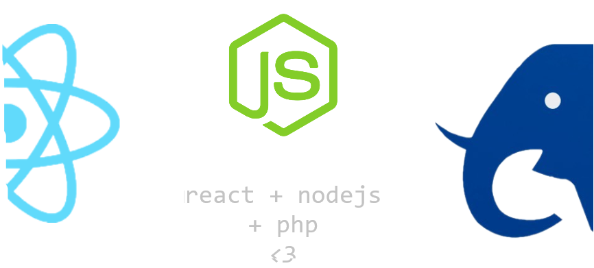

## Front-end Developer

Programador Front-end ReactJS  
Formando-me em Análise e Desenvolvimento de Sistemas na (UNIEURO)  
tentando não estar certo, e sim menos, errado # todos os dias!

# Tecnologias
       

> especializações

 

  <a href="https://github.com/luishdsg">
  
     

